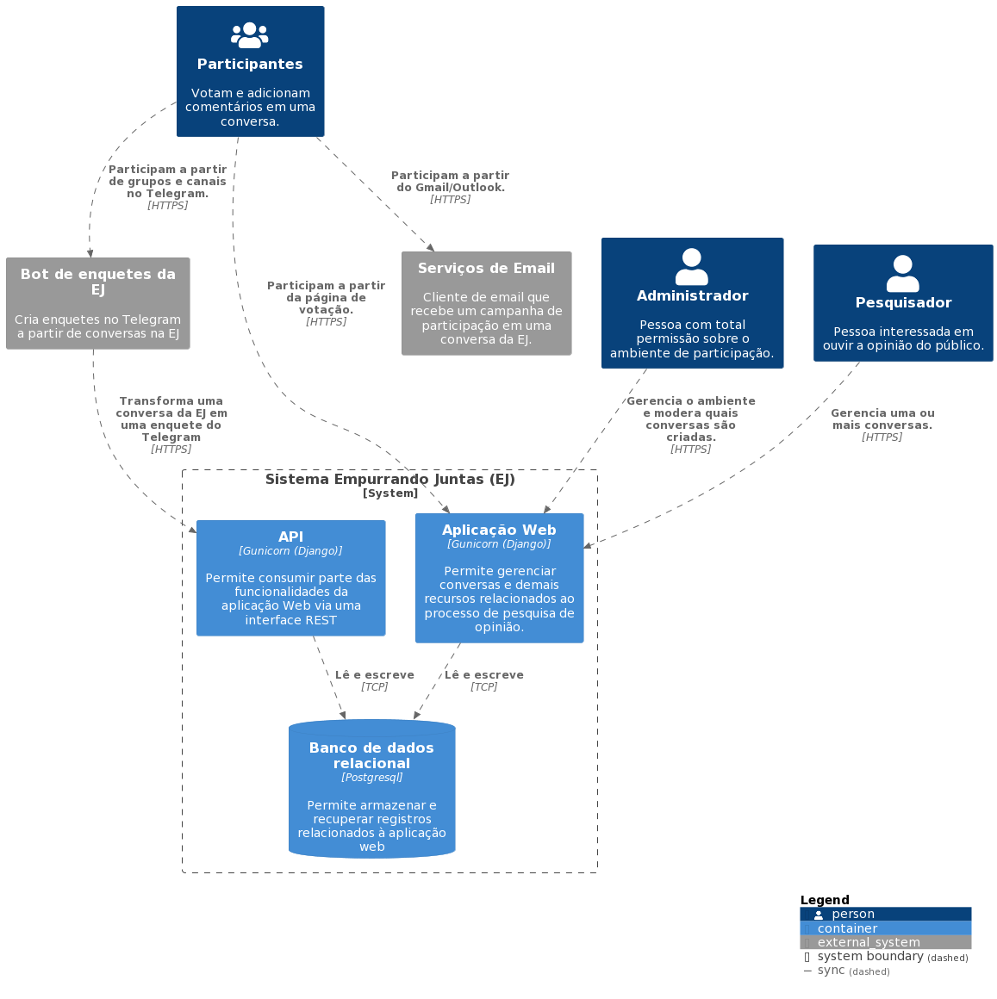

=======================
Arquitetura de Software
=======================

A Empurrando Juntas (EJ), é uma plataforma de pesquisa de opinião que,
a partir da modelagem de personas, permite agrupar participantes com opiniões
similares. Este agrupamento (também chamado de *cluster*), permite identificar
bolhas de opinião que não poderiam ser capturadas
por ferramentas comuns de *survey* como Google Forms e Survey Monkey. Para uma visão
mais aprofundada do funcionamento da plataforma, acesse :ref:`Start using`.

A EJ é uma aplicação monolítica desenvolvida com o framework `Django <https://www.djangoproject.com/>`_.
Além da aplicação web, também disponibilizamos uma API REST
implementada com o framework `DRF <https://www.django-rest-framework.org/>`_. Enquanto a aplicação web
permite a gestão do processo de participação, a API permite integrar uma pesquisa em
multiplos canais como Telegram, WhatsApp e sites de terceiros.

Atualmente, a aplicação é disponibilizada tanto em ambiente local quanto na nuvem utilizando Docker.
Para instruções de como subir o ambiente, acesse o `repositório do projeto <https://gitlab.com/pencillabs/ej/ej-application/>`_.
O diagrama a seguir apresenta uma visão geral de como estão organizados os containers do sistema.

   Diagrama de arquitetura da aplicação

No diagrama de arquitetura, temos dois sistemas externos em que o
perfil participante também interage. Isso ocorre porque um dos objetivos da plataforma
é realizar pesquisas de opinião em multiplos canais como listas de email e Telegram. Isso
só é possível por conta da API REST, que expõe parte das funcionalidades da aplicação
web para que seja possível conecta-la à outros sistemas.

.. note::

   O diagrama de arquitetura é versionado junto com o código-fonte. Para altera-lo,
   utilize o `arquivo docs/development-guides/diagrams/architecture_c4.puml` em conjunto
   com a biblioteca `PlantUML <https://plantuml.com>`_.

Ecossistema
============

O Ecossistema EJ é o conjunto de repositórios e ferramentas que desenvolvemos para permitir a coleta
de opinião em multiplos canais. Listaremos aqui os respositórios e uma breve descrição de cada um.

EJ Application
---------------

    **Repositório**: https://gitlab.com/pencillabs/ej/ej-application

    Aplicação web, API REST e guias de usuário e desenvolvimento.

Componente de Opinião
----------------------

    **Repositório**: https://gitlab.com/pencillabs/ej/conversation-component

    *Web Component* que permite integrar a jornada de participação da EJ em páginas html.
    A motivação desse projeto é viabilizar a participação nas conversas sem que o usuário precise
    ser redirecionado para outro ambiente.

Bot de Opinião
---------------

    **Repositório**: https://gitlab.com/pencillabs/ej/ej-bot

    Permite relizar coletas EJ via interface conversacional. Pode ser integrado no Telegram, Whatsapp
    ou página html. O bot é implementado utilizando o Framework Rasa.

Bot de Enquetes
----------------

    **Repositório**: https://gitlab.com/pencillabs/ej/ej-telegram-groups-bot

    Permite relizar coletas EJ no formato de enquetes do Telegram. O bot é implementando utilizando
    a SDK Python do Telegram.

.. _RST Aplicações que compõe o core:

Aplicações que compõe o core
============================

O Django utiliza a arquitetura MVT https://djangobook.com/mdj2-django-structure/. Nela, temos models (M)
controlando regras de negócio, views (V) processando requisições HTTP e templates (T), que controlam
apresentação e interação com o usuário. Todo projeto Django é composto por um ou mais ``apps``,
que são partes do sistema que agrupam funcionalidades relacionadas.

No contexto da EJ, temos ``apps`` que compoe o **core** do sistema e, por isso, implementam a
jornada básica dos usuários participante e pesquisador. Para o participante, isso representa
as seguintes possibilidades:

1. Se registrar no ambiente de participação.
2. Acessar a URL pública de uma ou mais conversas.
3. Votar em comentários de uma ou mais conversas.
4. Adicionar comentários em uma ou mais conversas.
5. Navegar nas conversas disponíveis para participação.
6. Editar informações em seu perfil.

Para o pesquisador, a jornada de participação representa o seguinte:

1. Gerenciar uma ou mais conversas.
2. Compartilhar uma ou mais conversas com seu público.
3. Acompanhar o andamento da participação pelo dashboard das suas conversas.
4. Modelar personas para que a plataforma gere os grupos de opinião.
5. Analisar os resultados de uma conversa por meio do relatório de comentários e participantes.

Os apps do `core` são a "espinha dorsal" da EJ, mas cada organização que adota o projeto
possui necessidades próprias como alterar o tema padrão, integrar a plataforma com outros sistemas
e assim por diante. A página :ref:`Customizando a EJ` apresenta o caminho para customizar o `core` e
adicionar novas funcionalidades à plataforma por meio do desenvolvimento de novos ``apps``.
O `core` da EJ é composto pelos seguintes ``apps``:

``ej_conversations``

    Aplicativo responsável por gerenciar a criação e gestão de uma conversa, comentários e votos.

``ej_users``

    Aplicativo responsável por gerenciar a criação e gestão dos usuários, incluíndo o processo de
    autenticação, recuperação de senha, login e logout.

``ej_profiles``

    Aplicativo responsável por gerenciar o perfil do usuário. O `ej_users` controla informações básicas relacionadas à autenticação enquanto o `ej_profiles` gerencia informações pessoais, como raça, gênero, número de telefone e imagem de perfil.

``ej_clusters``

    Aplicativo responsável por gerenciar as rotinas matemáticas de clusterização e classificação dos
    participantes. O módulo `ej_clusters.math`  implementa o nosso algorítmo K-means modificado,
    que permite agrupar usuários de acordo com a definição de personas.

``ej_dataviz``

    Aplicativo responsável pela visualização dos resultados de uma coleta, como a visualização de núvem de pontos, relatório de comentários, relatório de participantes, dashboard da conversa e grupos de opinião.

``ej_boards``

    Aplicativo responsável por agrupar as conversas do perfil Analista.

