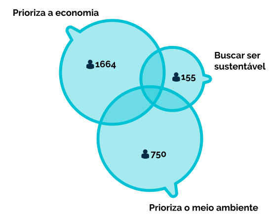

**********************************************
Bem vinda à documentação da Empurrando Juntas.
**********************************************

A Empurrando Juntas (EJ), é uma plataforma de pesquisa de opinião que,
a partir da modelagem de personas, permite agrupar participantes com opiniões
similares. Este agrupamento (também chamado de *cluster*), permite identificar
bolhas de opinião que não poderiam ser capturadas
por ferramentas comuns de *survey* como Google Forms e Survey Monkey.

   Grupos de opinião de uma conversa

O processo de participação na EJ é bem simples e funciona da seguinte forma:

1. O usuário se registra na plataforma (ou faz login utilizando email/senha).
2. O usuário cria uma nova conversa.
3. O usuário compartilha o link da conversa com seu público.
4. O público acessa a página da conversa e participa, votando nos comentários existentes e adicionando
   novos comentários que serão moderados e disponibilizados para voto.
5. O usuário acompanha a pesquisa por meio dos relatórios e pode modelar personas para gerar os
   grupos de opinião.
6. Com a modelagem das personas, a EJ gera os grupos de opinião e permite análises mais detalhadas
   da opinião do público, como por exemplo: quais comentários geraram menor convergência entre os participantes.

Com a nossa metodologia de criação e compartilhamento da conversa, é possível realizar pesquisas de opinião
em multiplos canais de maneira simples e rápida. **A EJ é a plataforma para auxiliar organizações de todos os
tamanhos à mapear as bolhas que compõe seu público-alvo e, a partir disso, traçar uma estratégia de comunicação vencedora.**

.. note::

    O objetivo deste guia é auxiliar a adoção da EJ em projetos de escuta
    e participação social, de modo a melhorar ações de comunicação e *advocacy*.
    A `Pencillabs <https://pencillabs.tec.br/>`_ em parceria com o `Instituto Cidade Democrática <https://cidadedemocratica.org.br/>`_ pode auxiliar na adoção da EJ na sua organização. Para uma demonstração,
    entre em contato pelo email `contato@pencillabs.tec.br <contato@pencillabs.tec.br>`_.

.. toctree::
   :caption: Guia de usuário
   :hidden:

   user-guides/pt-br/user-start
   user-guides/pt-br/creating-conversation
   user-guides/pt-br/conversation-access.rst
   user-guides/pt-br/voting
   user-guides/pt-br/analysis
   user-guides/pt-br/tools
   user-guides/pt-br/user-environment
   user-guides/pt-br/terms-of-use

.. toctree::
   :caption: Guia de desenvolvimento
   :hidden:

   development-guides/pt-br/contributing
   development-guides/pt-br/architecture
   development-guides/pt-br/api
   development-guides/pt-br/customizing
   development-guides/pt-br/environment-variables
   development-guides/pt-br/translations
   development-guides/pt-br/social-login
   development-guides/pt-br/smtp
