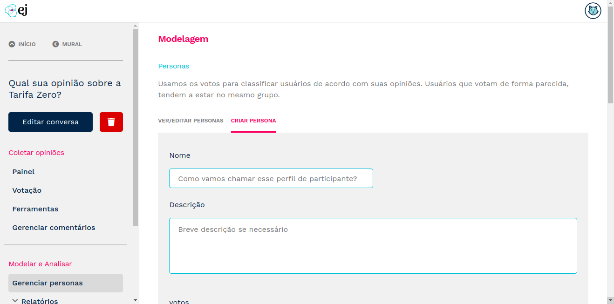
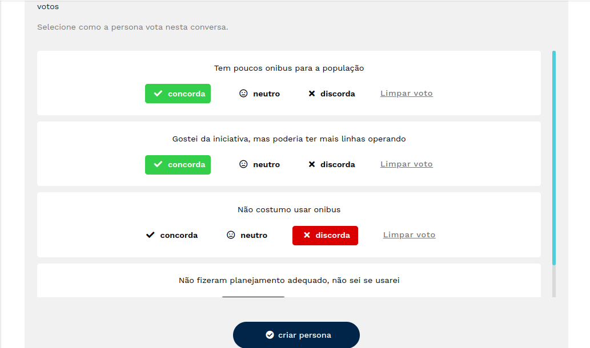

************************
Analisando uma conversa
************************

A Empurrando Juntas possui um conjunto de visualizações para analisar os
resultados de uma conversa. É importante ressaltar que o nível de confiabilidade
dos resultados apresentados pela plataforma dependem do volume de opiniões
coletadas. Quanto mais participantes votando e comentando, mais precisos
serão os grupos de opinião formados e mais robusta será a análise dos
comentários.

Dashboard da conversa
----------------------

O Dashboard apresenta um resumo do andamento da coleta. Possui visualizações
que permitem acompanhar a votação no tempo, as estatísticas de votação e de
participantes. Também permite acesso rápido aos relatórios de comentários
e de participantes. Tanto o criador da conversa quanto administradores
do ambiente podem acessar o Dashboard de uma conversa,
basta clicar na conversa desejada que o botão de acesso ao
Dashboard será apresentado. Ademais, o dashboard permite a exportação dos dados de votação,
nos formatos "csv" e "json".

.. figure:: ../images/dashboard.png
   :align: center

   Dashboard de uma conversa.

.. figure:: ../images/dashboard-groups-scatter.png
   :align: center

   Grupos de opinião e núvem de pontos.

.. figure:: ../images/dashboard-cluster-detail.png
   :align: center

   Visão detalhada de um grupo de opinião.

.. note::

    A etapa de análise é uma das mais importantes e é o que gera valor para organizações.
    A `Pencillabs <https://pencillabs.tec.br/>`_ em parceria com o `Instituto Cidade Democrática <https://cidadedemocratica.org.br/>`_ pode te auxiliar na produção de relatórios ricos e informativos utilizando
    os dados coletados pela EJ.

Relatório de comentários
-------------------------

O relatório de comentários permite analisar a performance dos comentários,
tanto no geral (considerando todos os participantes) tanto por grupo de opinião.
É possível filtrar os comentarios pelo conteúdo, pelo nível de concordância, discordância,
convergência, participação, entre outros. Também é possível exportar os dados apresentados, caso o usuário
queira utilizar outras ferramentas de *dataviz* para realizar suas análises. É possível exportar
os dados nos formatos "csv" e "json".

.. figure:: ../images/comments-report-2.png
   :align: center

   Relatório de comentários

.. figure:: ../images/comments-report-1.png
   :align: center

   Relatório de comentários por grupo

Relatório de participantes
--------------------------

O relatório de participantes permite analisar os dados dos participantes de uma coleta,
apresentando dados do usuário e o grupo no qual ele pertence naquele contexto.
É possível filtrar os participantes pelo nome e email, pelo nível de concordância, discordância,
participação, entre outros.
Com este relatório também é possível exportar os dados apresentados, caso o usuário
queira utilizar outras ferramentas de *dataviz* para realizar suas análises.

.. figure:: ../images/participants-report-1.png
   :align: center

   Relatório de participantes geral

.. figure:: ../images/participants-report-2.png
   :align: center

   Opções de exportação do relatório

Gestão de personas
-------------------

O estereótipo de uma conversa é uma generalização de um grupo de pessoas cujo as ações são similares, com base no histórico comum de participação em uma conversa. Seja votando, comentando ou pulando o sistema de votação. Exemplo: se temos uma conversa sobre uma temática de turismo, poderíamos definir como estereótipos os perfis de turistas: mochileiros, trabalho ou romântico, com base nos comentários ou participação nos comentários existentes.

Podemos afirmar que os estereótipos de uma conversa são pressupostos sobre um determinado grupo de participantes. Eles não afetam a formação dos grupos de opinião, mas eles ajudam o nosso algoritmo a inferir os tipos de participantes que fazem parte de cada grupo. Por isso é importante, na criação de cada conversa, arriscar de 2 a 4 estereótipos iniciais. Sem eles, nosso algoritmo de clusterização não exibirá os grupos de opinião.

Para criar uma persona, acesse a página de uma conversa e no menu lateral clique em "Gerenciar personas". Dê um nome à persona e se preferir uma descrição.

   Definição de nome e descrição de personas

Defina então como a persona se comporta na conversa em questão. Isso é feito
simulando os votos da persona nos comentários da conversa. 

   Painel de criação de persona

É possível também editar os dados e votos de uma persona e exclui-la. 

   Suporte à edição de nome e descrição da persona

   Suporte à edição de votos e exclusão de persona

Com pelo menos duas personas modeladas, é possível visualizar o agrupamento destas por meio de gráfico de bolha.

   Gráfico de bolhas que expressa os grupos de opinião 

Algorítmos
-----------

Para uma leitura mais aprofundada sobre os algorítmos de clusterização e
a arquitetura adotada pela plataforma,
recomendamos a leitura da monografia :download:`Plataforma de Participação Social para
Identificação de Grupos de Opinião Através de Modelos de
Clusterização <./luan_tcc.pdf>`.
