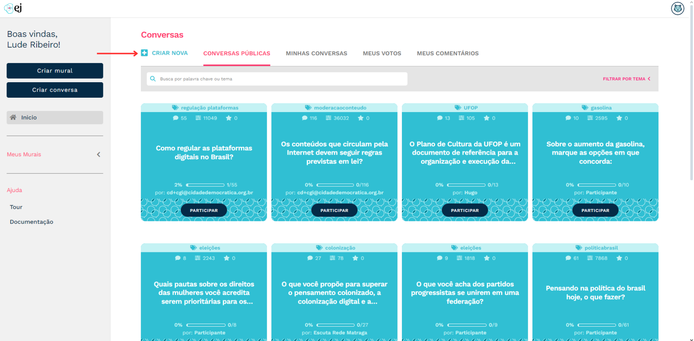

**************************
Como criar uma conversa?
**************************

Para criar uma conversa, basta clicar no botão "CRIAR NOVA", disponível na home do usuário logado.

   Botão para criar uma nova conversa

O formulário de criação de conversa possui uma série de campos que irão definir o que será apresentado
ao participante no momento da pesquisa. Dividiremos esses campos em **obrigatórios** e **opcionais**.

Campos obrigatórios
-------------------

1. **Pergunta**: ponto de partida para a coleta de opinião. Esse campo deve ser preenchido com um frase
   que estimule e guie a participação.
2. **Título**: texto curto que será utilizado para gerar a URL da conversa.
3. **Comentários iniciais**: conjunto de comentários que precisam ser cadastrados pelo criador da conversa,
   sem eles não há participação. Vale dizer que os próprios participantes poderão adicionar novos comentários,
   mas que irão para a área de moderação e só serão apresentados na conversa após aprovação do criador.
   Cada comentário da EJ possui três opções de voto: concordar, discordar e pular.

Campos opcionais
-----------------

1. **Participação anônima**: define quantos votos os participantes poderão dar antes de se cadastrar. Esse campo permite que o administrador envie o link para pessoas que não estejam cadastradas na EJ e ainda assim elas
   conseguirão votar em alguns comentários. Isso aumenta o engajamento e a conversão de novos usuários.
2. **Duração da conversa**: define o período em que a conversa ficará disponível para participação. Após a
   data final, a URL da conversa continua acessível mas um aviso de "conversa oculta" será apresentado.
3. **Mensagem de boas vindas**: permite que o criador da conversa cadastre um texto que será apresentado antes
   da página de participação. É um campo útil para dar mais contexto ao participante sobre o objetivo da coleta e quaisquer outra informação relevante para a participação.

Para tornar uma conversa popular, você precisa de uma boa pergunta e um dos principais critérios é que ela seja aberta para participação do público. Neste artigo você pode conferir um tutorial completo para fazer perguntas abertas: https://pt.wikihow.com/Fazer-Perguntas-Abertas
