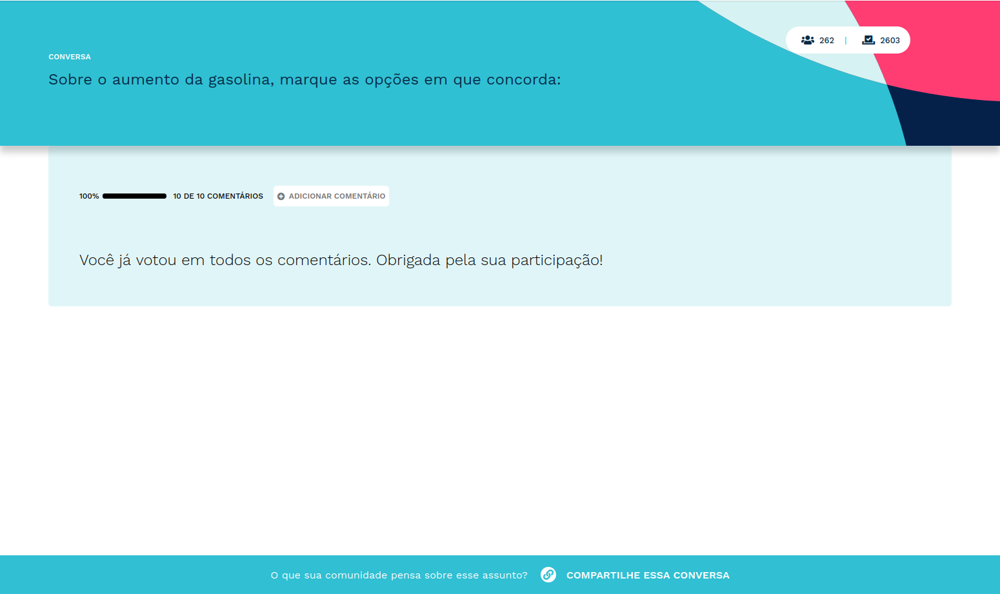

========================
Como criar uma conversa?
========================

Para criar uma conversa, basta clicar no botão "CRIAR NOVA", disponível na home do usuário logado.

.. figure:: ../images/home-new-conversation.png
   :align: center

   Botão para criar uma nova conversa

O formulário de criação de conversa possui uma série de campos que irão definir o que será apresentado
ao participante no momento da pesquisa. Dividiremos esses campos em **obrigatórios** e **opcionais**.

Campos obrigatórios
-------------------

Pergunta
********

Ponto de partida para a coleta de opinião. Esse campo deve ser preenchido com um frase que estimule e guie a participação.

Título
********

Texto curto que será utilizado para gerar a URL da conversa.

Comentários iniciais
********************

Conjunto de comentários que precisam ser cadastrados pelo criador da conversa, sem eles não há participação.
Vale dizer que os próprios participantes poderão adicionar novos comentários, mas que irão para a área de moderação e serão apresentados na conversa
após aprovação do criador. Cada comentário da EJ possui três opções de voto: concordar, discordar e pular.

Para tornar uma conversa popular, você precisa de uma boa pergunta e um dos principais critérios é que ela seja aberta para participação do público. Neste artigo você pode conferir um tutorial completo para fazer perguntas abertas: https://pt.wikihow.com/Fazer-Perguntas-Abertas

Campos opcionais
-----------------

Participação anônima
********************

Define quantos votos os participantes poderão dar antes de se cadastrar. Esse campo permite que o administrador envie o link para pessoas que não estejam cadastradas na EJ e ainda assim elas conseguirão votar em alguns comentários. Isso aumenta o engajamento e a conversão de novos usuários.

Duração da conversa
********************

Define o período em que a conversa ficará disponível para participação. Após a data final,
a URL da conversa continua acessível mas um aviso de "conversa oculta" será apresentado.

Banner customizado
*******************

Permite que o criador da conversa escolha uma imagem para ser apresentada no banner da conversa,
afim de contextualizar o tema a ser pesquisado.

Esta imagem fica disposta no cabeçalho da tela de votação.

Logotipo da organização
***********************

Permite que o criador da conversa insira uma logotipo, como por exemplo, a logotipo da organização que promove 
a coleta de opinião, para ser apresentada no momento que o participante acessa a página de participação.

Esta imagem é apresentada somente quando o criador da conversa define uma `mensagem de boas-vindas <creating-conversation.html#id1>`_.

.. figure:: ../images/welcome-page-logo.png
   :align: center

   Logotipo posicionada ao lado do botão para iniciar a coleta.

Mensagem de boas-vindas
************************

Permite que o criador da conversa cadastre um texto que será apresentado antes da página de participação.
É um campo útil para dar mais contexto ao participante sobre o objetivo da coleta e quaisquer outra informação relevante para a participação.

.. figure:: ../images/welcome-input-field.png
   :align: center

   Campo de cadastro do texto de boas-vindas.

Uma vez que o texto for cadastrado, apresentaremos a página de boas-vindas que irá contextualizar o participante.

.. figure:: ../images/welcome-page.png
   :align: center

   Tela de boas-vindas de uma conversa.

Mensagem ao final da votação
****************************

Permite que o criador da conversa cadastre um texto que será apresentado quando o participante finaliza a coleta.
É um campo útil para dar uma resposta de feedback, agradecimento ou alguma informação relevante ao usuário sobre a pesquisa.

.. figure:: ../images/ending-message-1.png
   :align: center

   Campo de cadastro do texto para o final da votação.

Uma vez que o texto for cadastrado, no momento em que o usuário finalizar a coleta, ela será exibida.

   Mensagem final em exibição no card de votação.
