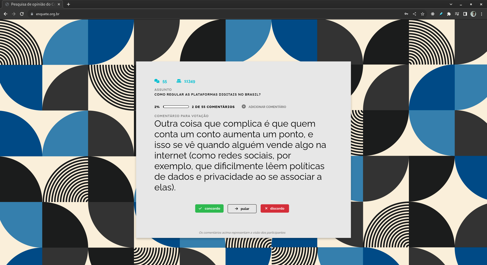
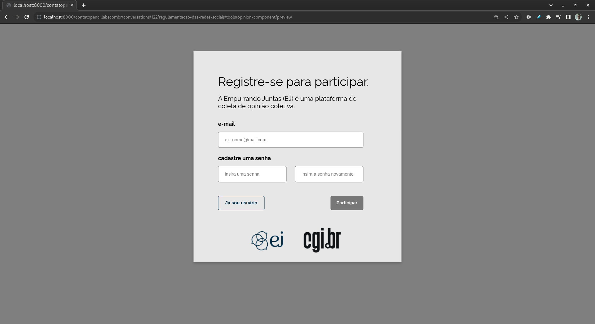
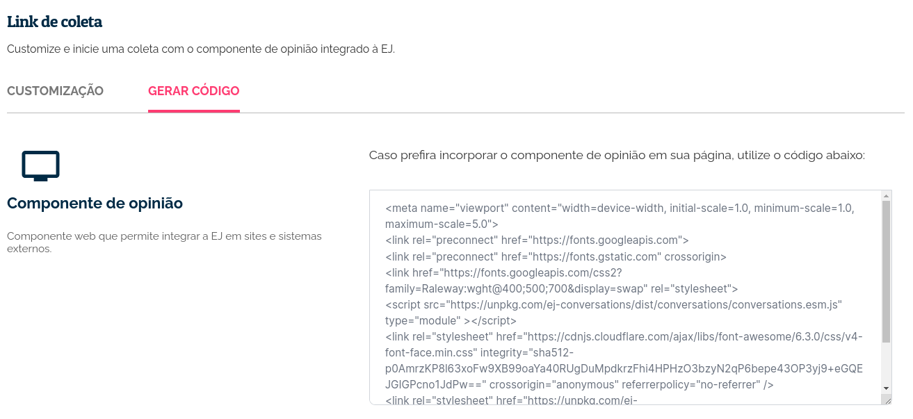
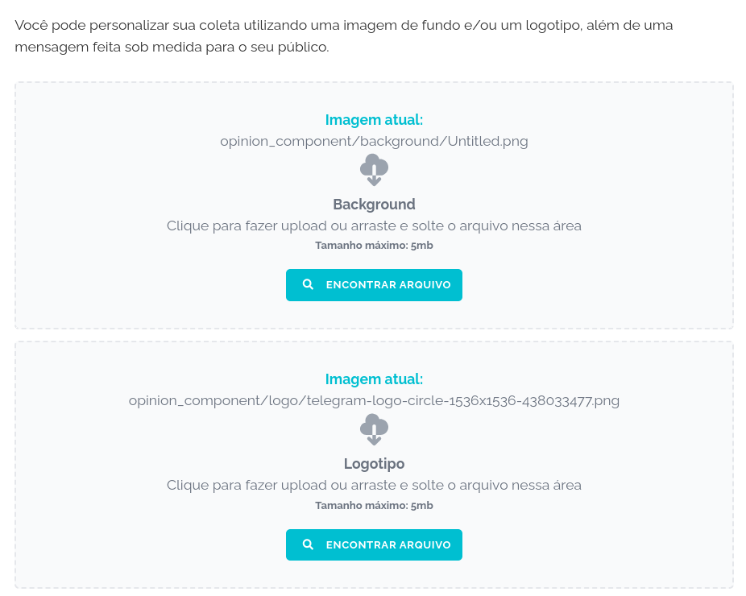

**********************
Componente de opinião
**********************

O componente de opinião é um projeto desenvolvido separadamente do código principal da EJ.
Seu objetivo integrar a jornada de participação em sites e plataformas de terceiros. O componente funciona da seguinte forma:

1. Usuário da EJ cria uma nova conversa (ou seleciona uma já existente).
2. Usuário da EJ integra o componente de opinião em uma página externa, como um site ou blog.
3. Visitante acessa o site ou blog, vota e comenta na conversa criada anteriormente.
4. Votos e comentários dados no componente são enviados para a EJ via API.

   Exemplo de uso do Componente de Opinião.

O Componente permite um fluxo de participação mais fluido, já que o usuário não precisa ser redirecionado
para a EJ. Ao utilizar o componente de opinião, o administrador da conversa é capaz
reaproveitar acessos ao seu site ou plataforma para realizar uma pesquisa de opinião,
sem exigir que o visitante tenha que ser redirecionado para a EJ para participar.

.. note::

    O componente de opinião é desenvolvido utilizando o
    framework `Stencil <https://stenciljs.com/>`_.
    Ele permite criar componentes web reusáveis, que uma vez
    carregados em páginas HTML, adicionam novos comportamentos e funcionalidades ao site.

Quando devo utilizar o Componente de Opinião?
==============================================

O Componente de Opinião é especialmente útil para usuários que possuem sites, blogs ou plataformas
web e querem que seu público participe de coletas nestes ambientes.

Como posso utilizar a ferramenta?
----------------------------------

Exitem duas formas de utilizar o Componente de Opinião.

1. Utilizando a página integrada da EJ. Com ela, você não precisa ter um site ou sistema web para
   realizar coletas com o Componente de Opinião. Basta acessar **Ferramentas > Componente de Opinião**
   e clicar no botão **Iniciar Coleta**. A vantagem dessa opção é que você pode enviar a URL dessa página
   para seus contatos e redes. Quem clicar no link, irá
   ser redirecionado para a página da EJ e conseguirá particiar da coleta. Essa forma democratiza
   o acesso à ferramenta, já que mesmo que você não tenha um site, ainda assim conseguirá fazer a coleta.

   Etapa de cadastro do Componente de Opinião.

.. warning::

    Para participar pela página integrada, você precisa estar deslogado da sua conta na plataforma.

2. A segunda forma é integrando o componente ao seu site ou plataforma web. Apresenteremos o passo a passo a seguir.

.. _Configurando o componente no seu site ou página html:

Configurando o componente no seu site ou página html
-----------------------------------------------------

Para integrar o componente de opinião em uma página HTML, acesse a aba "Gerar código", na página da Ferramenta.

   Código de integração para páginas HTML.

Copie o código gerado pela EJ e inclua no HTML da página que deseja fazer a integração. O browser irá
carregar o Componente de Opinião e apresentá-lo ao usuário. Desse ponto em diante, toda a comunicação com a EJ
será feita via API.

Configurando a aparência do componente de opinião
-----------------------------------------------------

Na página da ferramenta, é possível customizar três aspectos do Componente de Opinião:

1. A imagem de fundo que aparece junto com o card de participação.
2. A logomarca que irá aparecer ao lado da logo da EJ.
3. A mensagem de encerramento da coleta, apresentada depois que o participante vota em todos os comentários.

Para customizar a imagem de fundo e a logomarca, basta fazer upload dos arquivos nos respectivos campos da página
de configuração.

   Campos de upload de imagem para customização.

Para customizar a mensagem de encerramento da coleta, basta escrever o texto desejado no editor disponível na
página de configuração.

.. figure:: ../images/editor-opinion-component.png
   :align: center

   Editor de texto para customização da mensagem de encerramento.

Uma vez feita as configurações, o Componente irá carregar para o participante utilizando a imagens de fundo,
logomarca e mensagem de encerramento configuradas na página da ferramenta.

.. note::

    Caso não seja feita nenhuma customização, o componente irá carregar com uma imagem de fundo,
    logomarca da EJ e mensagem de encerramento padrão.

Configuração de CORS
--------------------

Para que o componente possa fazer requisições na API da EJ a partir de um domínio externo, é preciso adiciona-lo
na variável **CORS_ALLOWED_ORIGINS**, definida no arquivo :code:`src/ej/settings/__init__.py`.
Do contrário, o componente irá acusar acusar erro de `Cross-Origin Resource Sharing <https://developer.mozilla.org/en-US/docs/Web/HTTP/CORS>`_,
sempre que tentar requisitar informações na API da EJ a partir do domínio que estiver integrado.

Correções de css na pagina do componente
----------------------------------------

O componente fará o melhor possível para carregar bem enquadrado e responsivo, mas é possível que, dependendo de como a pagina foi construída, sejam necessários alguns ajustes no css para que o componente seja apresentado corretamente. Ferramentas como o Divi, muito utilizado no Wordpress para construção de sites, normalmente exigem algumas customizações para não quebrar o componente. Para corrigir as imagens anteriores, por exemplo, o seguinte css foi alterado no tema da página:

.. code-block:: css

  .et_pb_row {
    max-width: unset !important;
    width: unset !important;
    padding: unset !important;
  }
  .et_pb_section {
    padding: unset !important;
  }

  .. _Divi: https://www.elegantthemes.com/gallery/divi/

Para mais informações técnicas sobre o componente de opinião, acesse o `repositório do projeto <https://gitlab.com/pencillabs/ej/conversation-component>`_.
