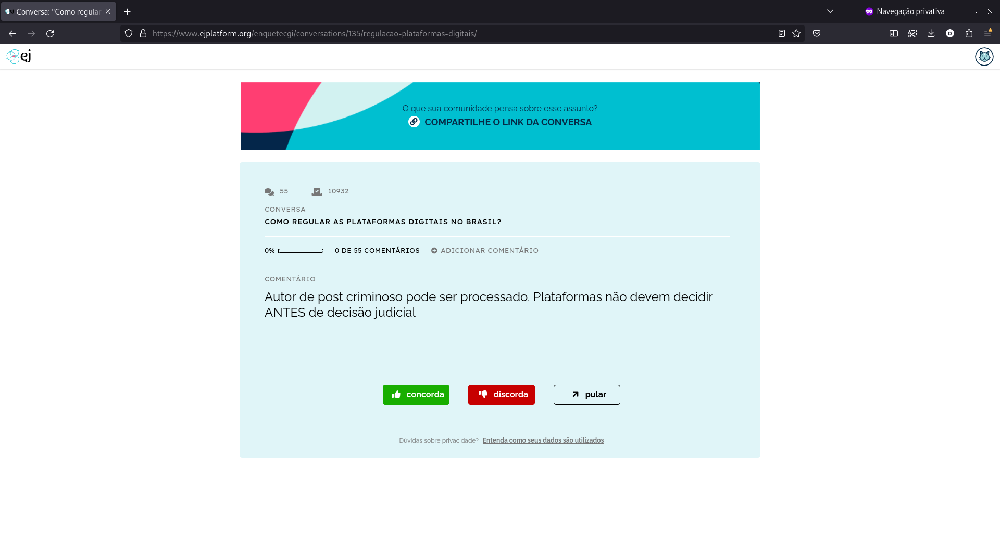
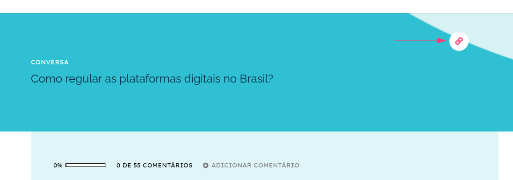
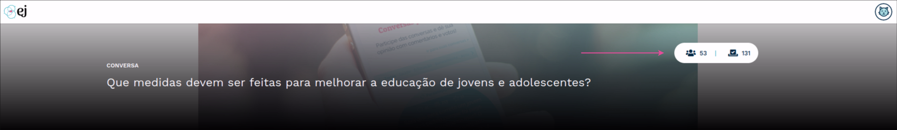

*********************************
Como participar de uma conversa?
*********************************

Para participar de uma conversa, basta acessar sua URL e a tela de participação será apresentada.
Isso pode ser feito pelo criador da conversa, clicando no botão de compartilhamento e enviado o link
para outras redes como grupos no WhatsApp e Telegram ou publicações no Facebook e Instagram.
Usuários logados também podem encontrar conversas que foram marcadas como "públicas" pelo administrador
do ambiente. Essas conversas irão aparecer na página Home, na aba "CONVERSAS PÚBLICAS".

.. note::

    Caso o criador da conversa tenha definido um período de encerramento e o acesso
    seja posterior à data final, a tela de participação não será apresentada.

Página de participação
----------------------

A página de participação é uma URL publica da EJ. Isso implica que qualquer pessoa com acesso ao link
consegue visualiza-la, mesmo que a conversa não tenha sido configurada para receber votos anônimos.

   Tela de participação apresentada aos usuários comuns.

Além de votar nos comentários disponíveis, o usuário também pode enviar comentários sobre a pergunta
da conversa. Estes comentários irão para moderação, antes de ficarem disponíveis para outros participantes.

.. figure:: ../images/commenting-page.png
   :align: center

   Tela de adição de comentários apresentada aos usuários comuns.

Compartilhando uma conversa
---------------------------

É possível compartilhar o link para a conversa clicando no texto "COMPARTILHE ESSA CONVERSA", disponível no final 
da página de participação. Nesse caso, o link será copiado para a área de transferência e poderá ser compartilhado 
com outros usuários. Os usuários poderão acessar e votar mesmo estando deslogado, caso o criador da 
conversa tenha configurado a participação anônima, nos `campos
opcionais da conversa <creating-conversation.html#campos-opcionais>`_.

   Botão de compartilhamento de uma conversa

Acessando estatísticas de uma conversa
--------------------------------------

Na lateral direita do *banner*, é possível ver informações sobre a conversa que você está participando.
A primeira informação do *card* mostra o número de participantes que votaram na conversa e a segunda informação mostra 
o número total de votos que a conversa recebeu de todos os participantes.

   Card de dados da conversa